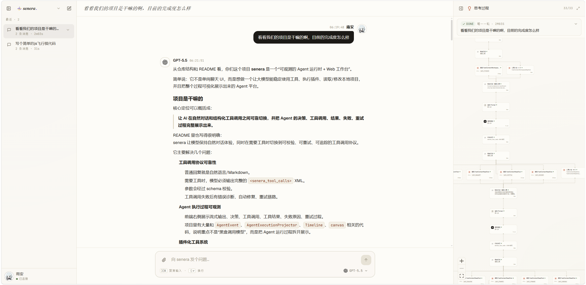

# senera

> 一个**可观测、可校验、可自愈**的 Agent 运行时与 Web 工作台。
> 让模型保持自然的对话体验,在需要工具时切换到结构化、可重试、全程可追踪的工具调用协议。

<p>
  
  
  
  
</p>

<p align="center">
  
</p>
<p align="center"><sub>三栏工作台 · 左:会话列表 · 中:自然对话 · 右:实时展开的决策 / 工具调用 / 思考过程时间线</sub></p>

senera 不只是又一个聊天壳。它的目标是让 AI 能**稳定地**搜索、读取项目、执行插件、修改文件,并把推理、决策、工具调用、失败与重试的**每一步都摊开给你看**。

---

## 为什么是 senera(区位优势)

市面上的 Agent 大多落在两端:要么把工具塞进模型原生的 JSON function-calling、对话和工具混在一起且难以校验;要么是一个看不见内部状态的黑箱。senera 选了第三条路——**把"对话"和"工具调用"彻底分开,并让工具调用这条链路变得可校验、可自愈、可观测。**

- **双模协议:对话归对话,工具归工具。**
  普通回复就是自然语言 / Markdown;只有真正需要工具时,整条回复才是一个 `<senera_tool_calls>` 根标签。聊天不会被 XML 包络污染,工具调用又能享受完整的结构化校验与审计。

- **工具调用"可校验 + 可自愈"——这是 senera 的核心竞争力。**
  每次工具调用都要过 **Zod schema 校验**。出问题时不是简单报错,而是**分层修复**:
  - 轻微格式问题(如参数未用 CDATA 包裹)→ 在解析前**程序性自动修补**;
  - 语义 / 结构错误 → 生成带**行号、列号、JSON Pointer 和修复建议**的诊断,连同协议文档一起喂回模型**重新生成**;
  - 全程有**重试上限**(`MaxRepairAttempts`)兜底,不会无限打转。

- **过程完全可见。**
  后端贯穿全流程发出 **40+ 种细粒度事件**(`model.delta` / `decision.*` / `tool.call.*` / `retry.planned` / `final.answer` …),带 `layer / phase / sequence / detailId`,经 WebSocket 实时推送。前端三栏工作台把流式输出、决策、工具调用、结果、失败原因和重试链路逐条展示出来。

- **动态工具发现,越用越准。**
  工具不必一次性全塞进上下文。senera 内置工具检索:**MiniSearch 本地索引 + BM25/精确/优先级多路 RRF 融合 + MMR 去冗余**,再叠加 **SQLite 记忆反馈**(用过哪些工具、成功与否会带半衰期地影响后续排序)。工具越多,上下文反而越干净。

- **多模型,一套接口。**
  OpenAI **Responses**、**Chat Completions**、Anthropic **Claude Messages**、Google **GenerateContent** 四种上游协议都是**真适配**(各自完整实现 `complete()` / `stream()`),统一的 SSE 流式解析,统一的首字超时 / 总时长 / 中断 / 网络重试控制。

- **插件进程级隔离。**
  外部工具插件以**子进程**运行,通过 stdin/stdout 的 JSON 协议通信,带**超时**、**stdout/stderr 字节上限**、独立工作目录与环境变量隔离。插件可用 Node.js、Python 或任意可执行文件实现。
  > 说明:插件 manifest 的权限(网络 / 文件系统 / 信任级别)目前是**声明式**的——用于发现、展示与调度决策,而非操作系统级强制沙箱。

---

## 工作原理

一次"行动 → 收尾"的循环大致是这样:

```
用户输入
   │
   ▼
ActionPlanner(BAML 轻量规划)──► 决定下一步:Answer / AskUser / DiscoverTools / UseTools
   │
   ▼
渲染提示(注入工具目录 + 协议契约 + 执行状态)
   │
   ▼
模型流式输出 ──► model.delta 实时可见
   │
   ▼
解析 & 校验  ──┐  失败?
   │           ├─► 程序性修补(CDATA 规范化)
   │           └─► 诊断 + 重新生成(带重试上限)
   ▼
执行工具(进程隔离 / 宿主能力)──► tool.call.* 全程可见
   │
   ▼
回填结果 ──► 进入下一步,或输出 final.answer
```

`ActionPlanner` 还会校验"模型实际输出的形态"与"规划意图"是否一致(例如规划要用工具却回了纯文本),不一致同样触发修复。

---

## 快速开始

要求:**Node.js 20+**

**1. 安装依赖**(根目录与前端各一次):

```bash
npm install
cd Frontend && npm install && cd ..
```

**2. 创建本地运行配置:**

```bash
# PowerShell
copy senera.config.example.json senera.config.json
```
```bash
# macOS / Linux
cp senera.config.example.json senera.config.json
```

编辑 `senera.config.json`,在 `ModelProviders` 里填好模型服务的 `BaseUrl`、`ApiKey`、`Model`。前端开发端口、预览端口和默认 WS 地址在 `Defaults.Frontend` 或顶层 `Frontend` 里配置。

**3. 启动后端:**

```bash
npm run server     # 默认 WebSocket 监听 ws://127.0.0.1:8787
```

**4. 启动前端**(另开一个终端):

```bash
cd Frontend
npm run dev        # 默认 http://127.0.0.1:5173
```

打开浏览器即可,前端会自动建一个空会话并连上后端。

也可以直接用 CLI:

```bash
npm run cli
```

> 真实的 `senera.config.json` 已在 `.gitignore` 中忽略,**不要把密钥提交到仓库**。

---

## 配置模型

最小配置见 [senera.config.example.json](./senera.config.example.json)。常用字段:

| 字段 | 说明 |
|---|---|
| `DefaultModelProviderId` | 默认使用的模型提供方 `Id`。 |
| `ModelProviders[]` | 模型提供方列表,前端会自动读取并展示。 |
| `ModelProviders[].Endpoint` | 上游协议:`Responses` / `ChatCompletions` / `ClaudeMessages` / `GoogleGenerateContent`。 |
| `MaxOutputTokens` | 填 `-1` 表示不传该 API 字段,让模型自由输出。 |
| `TimeoutMs` | 等待上游响应头的超时。 |
| `FirstTokenTimeoutMs` | 流式首个文本增量的超时,`-1` 表示不限制。 |
| `MaxRequestMs` | 单次模型请求总时长上限(含完整流式输出),`-1` 表示不限制。 |
| `AgentLoop.MaxSteps` | 最大行动步数,`-1` 表示不限制。 |
| `AgentLoop.MaxRepairAttempts` | 工具调用解析 / 校验失败后的自动修复重试上限。 |
| `AgentLoop.LoadedTools` | `"dynamic"` 动态按需发现工具(推荐);`"all"` 加载全部;也可填工具名数组做白名单。 |
| `ToolSearch.*` | 动态工具发现的旋钮:`BootstrapTools` 启动工具、`Memory`(SQLite 记忆 / 半衰期)、`Ranking`(RRF / MMR 参数)、`Rerank`(字段化轻量重排)。 |
| `ActionPlanner.*` | 行动规划器:是否启用、目录工具上限,以及 `Client.Provider`(默认 `"auto"`,按当前 `Endpoint` 自动同步 BAML planner 路由)。 |
| `Artifacts.*` | 工具调用证据包落盘位置与大小上限。默认写入 `.senera/artifacts/runs`。 |

---

## 工具与插件

senera 的工具是**插件化**的。每个插件自带:`PluginManifest.json`(声明工具名、签名、文档、权限与运行入口)、`ToolSignature.ts`(参数契约,驱动 schema 校验与提示生成)、可选的 `docs/*.md`(给模型看的工具说明)。宿主只负责发现、校验、调度与隔离。

内置 / 示例能力:

**系统插件**(`System/Plugins/`,支撑运行时本身)
- `AgentDecisionPlugin` — 工具调用决策协议(`senera_tool_calls`)。
- `AgentToolSearchPlugin` — 动态工具检索与发现。
- `AgentPatchToolPlugin` — 以受控补丁方式修改文件。
- `AgentShellToolPlugin` — 在配置的安全工作区内执行命令。
- `AgentTemplatePlugin` — 提示模板(Liquid)。

**示例 / 业务插件**(`Plugins/`)
- `AskUserTool` — 缺少必要信息时向用户提问。
- `TavilySearchTool` — 联网搜索,支持多 key 轮询。
- `FastContextWorkspaceMapTool` — 快速了解工作区结构。
- `FastContextSearchTool` — 基于 ripgrep 的快速文本 / 符号搜索。
- `FastContextIndexSearchTool` — 本地轻量索引搜索。
- `FastContextReadTool` — 按文件读取上下文。
- `WeatherTool` — 天气查询示例插件。

插件私有配置放在 `PluginConfig.toml`(如 Tavily API key),已默认忽略;需要公开模板时用 `PluginConfig.example.toml`。

### Artifact Pack

每次工具调用都会生成独立 artifact 包,包含 `manifest.json`、`input.redacted.json`、`raw.json`、`summary.md`、`evidence.json`、`projection.md`、`delta.json`。路径由运行时生成绝对目录,模型上下文只接收摘要、证据键和文件引用。

工具能力和风险由每个插件自己的 `PluginManifest.json` 声明。核心只读取插件声明的 `Search.Capabilities`、权限和 artifact 策略,不扫描字段名或工具名来猜工具语义。

涉及工作区变更的工具可以在自己的 `PluginManifest.json` 里声明 `Artifacts.Workspace`。宿主只按插件声明的 selector 捕获路径,生成:

- `workspace.before.json` / `workspace.after.json`: 机器可读快照,含路径、hash、大小、内容样本的 artifact 引用。
- `workspace.diff.json`: 机器可读变更表,含 added/modified/deleted/type_changed/unchanged 和 patch 引用。
- `workspace.patch`: 标准 unified diff,用于人工复核。
- `workspace/before/*` / `workspace/after/*`: 小文本文件的前后内容样本。

这层目前不依赖 SQLite index。SQLite 后续只需要索引 artifact 包里的 manifest/evidence/delta,不用参与工具执行时的 diff 生成。

---

## 协议设计

senera 把模型输出分成两种模式:

- **普通回复**:直接输出自然语言或 Markdown。
- **工具调用**:整条回复只能是一个完整的 `<senera_tool_calls>` XML 根标签。

这样既避免了普通聊天被 XML 包络污染,又为工具调用保留了结构化校验、自动修复与审计能力。XML 解析基于 `fast-xml-parser`,并对深度、工具调用数量、决策 token 等设有上限(见配置中的 `XmlProtocol`)。

---

## 项目结构

```
senera/
├─ Source/AgentSystem/      Agent 运行时核心(循环 / 解析 / 校验 / 修复 / 事件 / 持久化)
│  └─ ModelEndpoints/       四种上游协议适配 + SSE 流式
├─ System/Plugins/          系统插件(决策协议、工具检索、补丁、Shell、模板)
├─ Plugins/                 示例 / 业务工具插件
├─ Packages/                可复用内部包(ToolPluginSdk、WorkspaceContextCore)
├─ baml_src/                BAML 定义(ActionPlanner 行动规划)
├─ Scripts/                 启动脚本与各类校验脚本(Server / Cli / Verify*)
├─ Frontend/                React + Vite 三栏 Web 工作台
└─ senera.config.example.json   运行与 CLI 配置模板
```

进一步开发前建议先看:

- [核心链路导览](docs/Architecture/CoreFlow.md):理解一次请求从用户输入到工具执行、记忆、前端事件投影的主路径。
- [开发手册](docs/Development/README.md):新增工具、运行时事件、模型端点时的标准落地路径。
- [术语表](docs/Glossary.md):统一理解 Contract、Projection、Artifact、Memory Source 等内部术语。

---

## 常用命令

后端 / 运行时:

```bash
npm run check      # 类型检查(tsc --noEmit)
npm run build      # 清理并编译到 Dist/
npm run server     # 编译并启动 WebSocket 服务
npm run cli        # 编译并启动 CLI
```

前端:

```bash
cd Frontend
npm run check
npm run build
npm run dev
```

---

## License

本项目基于 [Apache License 2.0](./LICENSE) 开源。
